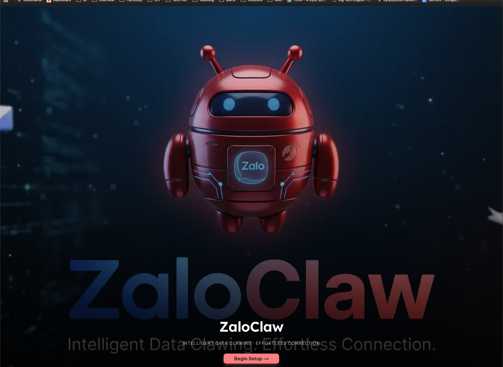
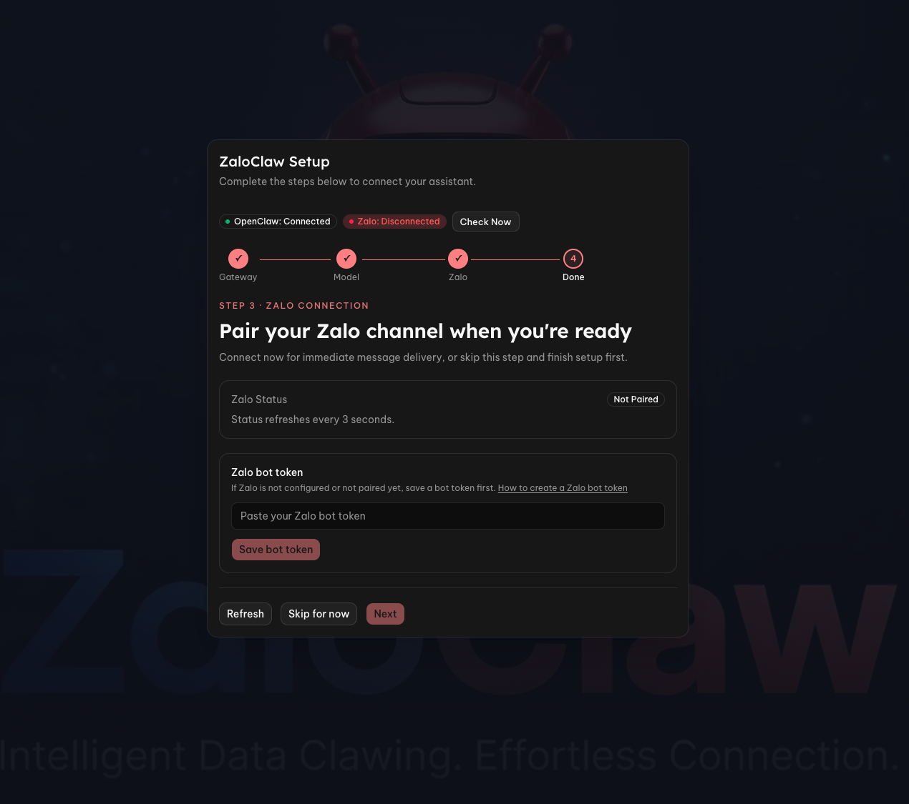

# zaloclaw-ui

ZaloClaw UI is a setup companion for running OpenClaw with Zalo smoothly on your local machine.

Its primary purpose is to make OpenClaw onboarding easier and less error-prone for Zalo users.



## Project Purpose

This project helps users quickly configure and operate a Zalo-powered OpenClaw assistant, with guided flows for common setup tasks.

## What This Project Helps You Set Up

- Configure Zalo bot token and related connection settings.
- Pair and manage gateway or local devices used by the assistant.
- Set up browser automation workflows for assisted tasks.
- Enable local search and retrieval through browser-based capabilities.

## Goal

Reduce setup friction so users can move from initial installation to a working Zalo + OpenClaw assistant with minimal manual configuration.

## Setup

Start the app locally with one command:

```bash
npm run dev
```

Then open the local URL shown in terminal (usually `http://localhost:3000`) and follow the onboarding flow.

## Docker Compose (Local Trusted Mode)

You can run the UI with Docker Compose while keeping dashboard operator features that call `docker exec`.

### Prerequisites

- Docker Engine is installed and running on your machine.
- OpenClaw gateway is already running from your separate setup.
- The running gateway container name matches `OPENCLAW_GATEWAY_CONTAINER`.

### 1. Configure environment

Use `.env.local.example` as the reference for runtime values:

- `NEXT_PUBLIC_GATEWAY_URL`: gateway WebSocket endpoint used by browser client.
- `OPENCLAW_GATEWAY_CONTAINER`: exact container name targeted by server-side `docker exec`.
- `OPENCLAW_COMMAND_TIMEOUT_MS`: timeout for non-interactive command routes.

### 2. Build and run

```bash
docker compose up --build
```

After startup:

- UI is available at `http://localhost:3000`
- Gateway is expected at `ws://host.docker.internal:18789` by default in containerized mode.

### 3. Check external gateway availability

The compose stack does not start OpenClaw gateway. It only checks whether your configured gateway container is running.

You can verify manually:

```bash
docker inspect -f '{{.State.Running}}' "$OPENCLAW_GATEWAY_CONTAINER"
```

Expected output: `true`

### 4. Runtime assumptions for command features

Dashboard command flows (`openclaw`, cron actions, gog commands) run from Next.js API routes and require:

- Docker CLI available in the UI container.
- Docker socket mounted into the UI container (`/var/run/docker.sock`).
- Correct `OPENCLAW_GATEWAY_CONTAINER` value.

### Troubleshooting

- `No such container`:
	- Verify `OPENCLAW_GATEWAY_CONTAINER` matches the running gateway container name.
	- Verify your external gateway stack is up before starting UI workflows.
- `docker: not found`:
	- Rebuild the UI image and confirm Docker CLI is present in the container.
- Timeout errors on dashboard command execution:
	- Increase `OPENCLAW_COMMAND_TIMEOUT_MS`.
- Gateway connection failures in browser:
	- Check `NEXT_PUBLIC_GATEWAY_URL` and your external gateway port mapping.

### Security boundary

Mounting Docker socket gives the UI container privileged control over the host Docker daemon. Treat this compose setup as local trusted/development mode, not a hardened production deployment.

## Onboarding Walkthrough

### 1. Welcome

Use the welcome screen to start the guided onboarding flow.

### 2. OpenClaw Config Check

Verify that OpenClaw is reachable and healthy before moving forward:

- Confirm gateway config is loaded (assistant name and server version).
- Check websocket connection status.
- Add or update your gateway token if needed.
- (Optional) Expand advanced fields for device ID / keys / device token.
- Save config, then continue when connection status is ready.

### 3. Model Selection

Select the model OpenClaw should use by default:

- Load available model options from current config.
- Choose a primary model.
- Save your selection to persist it into configuration.
- Continue to Zalo setup.

### 4. Zalo Config & Pairing

Complete Zalo integration and pairing:

- Check channel status and wait for auto-refresh.
- Add and save your Zalo bot token.
- Paste pairing guide text and execute the approve command.
- Confirm paired status, then proceed to completion.



### 5. Complete

Finish onboarding and enter the dashboard with OpenClaw + Zalo ready.

## Author

**Hưng Nguyễn** — Đam mê AI, thích tự động hóa và đơn giản mọi thứ.
